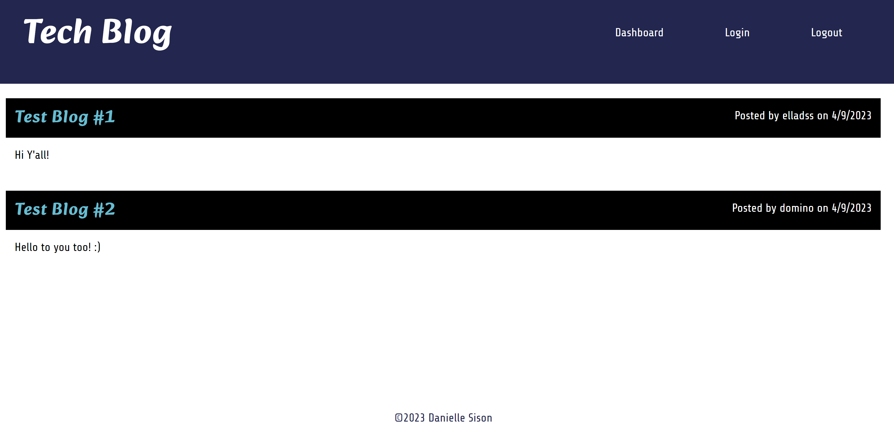

# Nux Technologia IX

## URL: https://nux-technologia-ix.herokuapp.com/

## Description

Tech-Blog deployed in HEROKU utilizing the MVC framework.

## Installations

N/A

## Usage

Visit the deployed URL given at the top of this README then do the following:

<ol>
<li>Create your own user profile by signing up by clicking Login at the navigation bar.</li>
<li>Create a new post under your Dashboard, you may edit, update, and delete posts under your Dashboard.</li>
<li>To see all the users posts and comments, click on the 'Tech Blog' on the upper left of the page. You may be able to comment on these posts when you click on them whilst you are logged in</li>
<li>Logout if you are done with your session, for future usage, you may just login in rather than sign up.</li>
</ol>

## Screenshot

Below is a page preview of the app:

## Credits

The following programs / guides were used to create this project:

<ul>
<li>Node.js - https://nodejs.org/en/</li>
<li>Inquirer.js - https://www.npmjs.com/package/inquirer</li>
<li>Bcrypt - https://www.npmjs.com/package/bcrypt</li>
<li>Mysql2 - https://www.npmjs.com/package/mysql2</li>
<li>Sequelize - https://www.npmjs.com/package/sequelize</li>
<li>dotenv - https://www.npmjs.com/package/dotenv</li>
<li>Express Handlebars - https://www.npmjs.com/package/express-handlebars</li>
<li>Express - https://www.npmjs.com/package/express</li>
</ul>

Thank you to the instructors and TA's that helped with this project.

## License

N/A